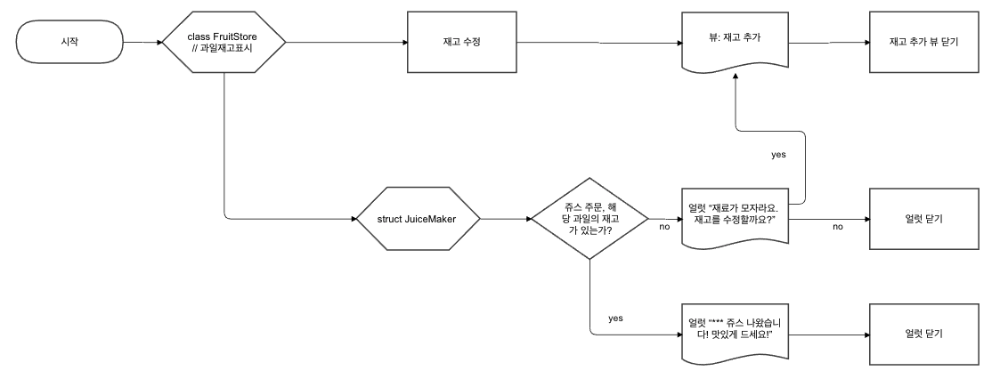
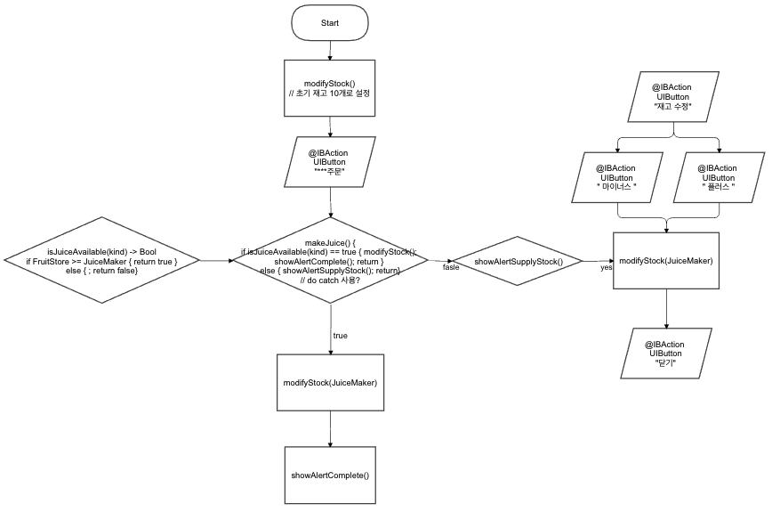

# 🥤 Juice Maker

과일의 재고를 확인해 레시피에 맞는 쥬스를 만들어주는 쥬스메이커입니다.

## Flow chart

## 기능구현

### Step1

1. FruitStore.swift

   - `class FruitStore`는 과일의 재고를 관리하고, 재고를 수정합니다.

2. JuiceMaker.swift

   - `struct JuiceMaker`는 메뉴를 관리하고, 쥬스를 만듭니다.

   - 메뉴는 열거형 형태로 저장합니다. 
   - `juiceRecipe(juiceManu:)`를 통해 사용자가 선택한 쥬스에 필요한 과일과 갯수를 알 수 있습니다.
   - 쥬스를 만들 때 `isJuiceAvailable(menu:)`을 통해 쥬스 레시피보다 과일의 재고가 많은지 체크합니다.
   - `makeJuice(menu:)`를 통해 과일의 재고를 차감하거나 에러를 던집니다.

### Step2

1. FruitStore.swift
   - `sendNotifications()` 를 통해 `storage` 의 값이 `modifyStock(fruit:changes:)` 에서 변경되면 발송합니다.
2. ViewController.swift
   - `modifyStockButton(_:)` 을 통해 재고 수정 화면으로 이동합니다.
   - `whenButtonTapped(menu:)` 를 통해 `juiceMaker`의 쥬스를 만드는 함수 `makeJuice(menu:)`를 시도합니다.
     성공하면 "***쥬스 나왔습니다! 맛있게 드세요!" 알럿이 나타납니다.
     실패하면 "재료가 모자라요. 재고를 수정할까요?" 알럿이 나오고, `예` 를 누르면 재고 수정 화면으로 이동, `아니오` 를 누르면 알럿이 닫힙니다.
   - `createObservers()` 를 통해 notification observer를 등록합니다.
   - `updateFruitLabel(_:)`, `changeNumberOfUILabel(fruitInformation:)` 를 통해 받아온 `storage` 의 값을 `UILabel.text` 에 넣어줍니다.

## 배운 키워드

1. NotificationCenter
2. 타입의 캡슐화/은닉화
3. Dictionary Type
4. Error Handling
5. Enumerations
6. Alert Controller
7. MVC Pattern