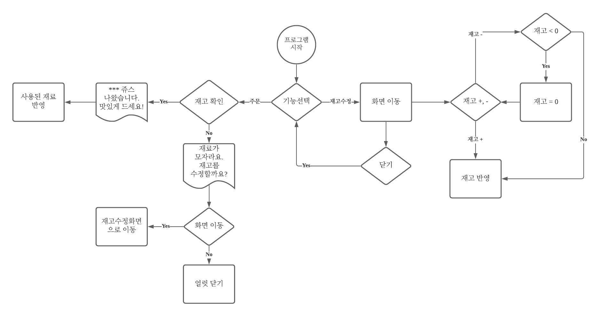

# 쥬스메이커 

## 이 프로젝트는
MVC패턴, KVO, Notification Center, Singleton, 캡슐화/은닉화, 결합력/응집력, 뷰 간의 데이터 이동 등의 학습을 목표하고 있습니다. 

## 이 앱의 내용은
다양한 과일 쥬스를 주문하는 것 입니다. 현재 재고량에 따라 과일 쥬스가 만들어지지 않을 수 있습니다 
그러한 경우에는 재고수정 화면으로 진입 해 재고량을 수정하게 됩니다. 혹은 과일 쥬스 버튼을 클릭한 후 재고가 수정되지 않았다는 알람을 통해 재고 수정 화면으로 들어갈 수 있습니다. 

### 흐름도

