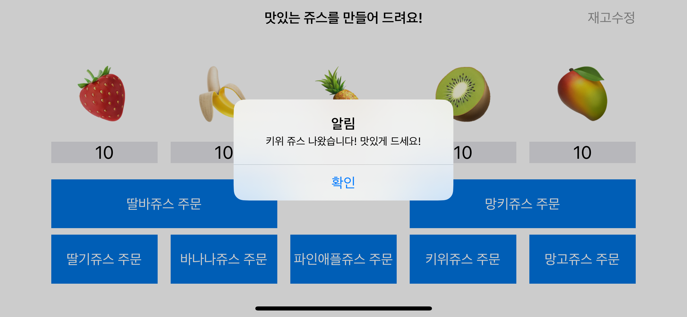
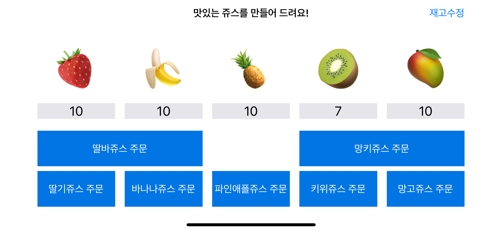
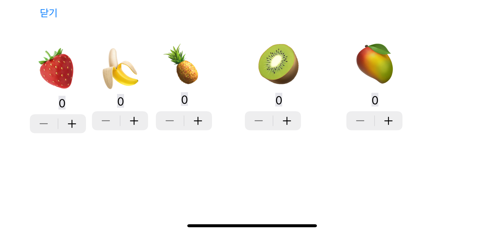

# 🧃 쥬스메이커
### 목차
[1. 소개](#1-소개)<br>
[2. 팀원](#2-팀원)<br>
[3. UML](#3-uml)<br>
[4. 실행 화면](#4-실행-화면)<br>
[5. 타임 라인](#5-타임-라인)<br>
[6. 고민한 부분](#6-고민한-부분)<br>
[7. 팀 회고](#7-팀-회고)<br>
[8. 참고 자료](#8-참고-자료)<br>

## 1. 소개 
과일 창고(FruitStore)에 있는 과일(딸기, 바나나, 파인애플, 키위, 망고)을 사용하여 맛있는 쥬스(딸기, 바나나, 딸기바나나, 파인애플, 키위, 망고, 망고키위 쥬스)를 만듭니다!</br>
메인 화면에서 쥬스를 주문하면 과일 창고에서 해당 쥬스를 만들기 위해 필요한 과일의 재고를 확인합니다. 쥬스를 만들기 위한 재고가 충분한 경우, 성공적으로 과일 쥬스가 만들어집니다. 재고가 부족한 경우, 알람을 띄워 과일의 재고를 수정할 수 있도록 합니다. 또한 내비게이션 바 우측의 재고 수정 버튼을 누르면 과일의 재고를 수정할 수 있습니다.</br>

## 2. 팀원
| [diana](https://github.com/Diana-yjh) | [gama](https://github.com/forseaest) |
| --- | --- |
|  |  |

## 3. UML

#### 시퀀스 다이어그램
 

#### 클래스 다이어그램
 

## 4. 실행 화면
| 상황 | 스크린 샷 |
| --- | --- |
| 첫 화면 |  |
| 주문에 성공한 경우 |  |
| 주문 성공 후 화면 |  |
| 재고가 모자른 경우 |  |
재고 수정 화면 |  |

## 5. 타임 라인
|날짜|내용|
|:---:|:---|
|24.01.16(화)|프로젝트 요구사항 확인, 과일 프로퍼티 생성 및 수량 변경 함수 구현, 과일 재고 확인 함수 구현|
|24.01.17(수)|과일 종류 열거형 이름 변경</br> 쥬스 레시피 구조체로 분리</br> 쥬스 레시피 별 재료 조합을 리턴해주는 계산 프로퍼티 추가</br> 과일의 종류를 FruitCategory 열거형으로 생성|
|24.01.18(목)|불필요한 리턴 타입 제거 등 첫 리팩토링|
|24.01.22(월)|FruitStore의 과일 재고 확인과 과일 재고 사용 기능 분리</br> FruitStore에 싱글톤 패턴 적용</br>JuiceMaker의 makeJuice 로직 변경</br>ViewController에서 FruitStore 값 초기화 시도</br>과일 재고 확인 함수 이름 변경(checkStock -> CheckSufficientStock)|
|24.01.23(화)|JuiceMaker 내부 로직 수정|
|24.01.25(목)|FruitStore 싱글톤 해제 및 사용 지점 삭제</br>전역 변수 및 상수 수정</br>FruitStore 프로퍼티 값 변경 및 init을 통한 프로퍼티 초기화</br> ViewController에서 FruitStore 초기화|
|24.01.26(금)|JuiceMenu 열거형 수정|
|24.01.29(월)|ViewController와 스토리보드 연결</br>쥬스 생성 버튼에 쥬스 생성 메소드 연결</br>과일 재고 가능여부 확인 함수 이름 변경(checkStock -> isAvailable)</br>과일 재고 가능여부 확인 함수에서 조건 체크 부분을 if 로 통일</br>MenuList 구조체로 변경|
|24.01.30(화)|에러처리에 대한 공부 및 에러처리 적용</br>각 함수에 에러처리 추가</br>중복 로직 리팩토링|
|24.01.31(수)|과일 재고 소진 뒤 Label에 표시 값 변경</br>JuiceMaker 만을 통해서 과일 재고 접근 가능하도록 수정</br>ModifyStockViewController 로의 이동 방법 수정</br>불필요한 예외 처리 제거|

## 6. 고민한 부분
### 함수와 변수의 네이밍
- 입력된 쥬스 메뉴가 제조가 가능한지 여부를 Bool로 리턴해주는 `checkSufficientStock(recipe: [JuiceMenu])`, 입력된 과일의 재고가 레시피의 용량만큼 존재하는지를 Bool로 나타내주는 `checkFruitStock(fruitForRecipe: JuiceMenu)`의 이름을 isAvailable로 동일하되, 파라미터 형식이 다른 이름으로 변경했습니다. 또한 파라미터명도 각각 menu, fruit로 변경했습니다.

### 내비게이션 바가 나타나지 않는 현상
- ```JuiceMakerViewController```에서 ```ModifyStockViewController```로 이동하는 부분에서 ```ModifyStockViewController```로 직접 present를 하여 ```ModifyStockViewController```의 ```navigationBar```가 보이지 않는 문제가 발생했습니다. 이 경우 ```ModifyStockViewController```를 바로 present 하지 않고 ```ModifyStockViewController```가 속한 ```navigationViewController```를 present 함으로써 문제를 해결했습니다.
```swift
@IBAction func modifyStockButtonTapped(_ sender: Any) {
    guard let viewController = self.storyboard?.instantiateViewController(withIdentifier: "ModifyStockViewController") as? ModifyStockViewController else {
        return
    }
        
    let navigationController = UINavigationController(rootViewController: viewController)
    self.present(navigationController, animated: true)
}
```

### 에러 처리
- 에러 처리에 대해서 처음 공부해보고 논의하여, 발생할 수 있는 에러를 enum으로 선언했습니다.
    - `outOfStock`: 재고 부족
    - `invalidFruitName`: FruitStore에 존재하지 않는 과일 종류 입력
    
    ```swift
    enum FruitStoreError: Error {
        case outOfStock
        case invalidFruitName
    }
    ```
    
- 주스를 주문하는 `tryMakingJuice` 함수에서 do catch문으로 주스를 만들 수 있는지 확인하고, 과일들을 소모하면서 만약 에러가 발생한다면 상황에 맞게 다른 대처를 취할 수 있도록 했습니다.

### 의존성 주입
  - 쥬스메이커 컨트롤러에서 쥬스 창고에 직접 접근하던 코드를 수정하여 쥬스 창고는 쥬스메이커에서만 접근할 수 있도록 수정했습니다.
  - 쥬스메이커 컨트롤러에서 쥬스 창고에 접근하기 위해서는 쥬스메이커에 생성된 함수를 사용하도록 수정했습니다.
```swift
// FruitStore.swift
private var fruits: [FruitCategory: Int]

// JuiceMaker.swift
private var fruitStore: FruitStore
```

### 클래스와 구조체의 사용
- FruitStore와 JuiceMaker와 같은 객체 타입을 클래스로 만들지, 구조체로 만들지에 대해서 고민이 많았습니다. 처음에는 단순히 상속의 필요성을 근거로 들었으나, 클래스는 참조 타입, 구조체는 값 타입인 특성도 반영하여 결정하게 되었습니다.

## 7. 팀 회고
| 팀원 | 내용 |
| --- | --- |
| gama | 프로젝트를 진행하면서 몸 상태가 난조된 상황이 많아서 진도가 더뎌지는 현상이 발생했습니다. 이 부분이 아쉽고 후회되는 지점이었습니다. 그러나 많은 것을 알아가고 생각해보고 얕은 개념들을 복습할 수 있는 좋은 기회였습니다. |
|diana|1. 우리 팀이 잘한 점</br>꾸준한 소통을 통해 서로에게 맞춰가며 프로젝트를 진행 했고 같이 모르는 개념 들은 공부하는 시간을 가져 실력 향상에도 많은 도움이 되었습니다.</br>2. 우리 팀의 아쉬웠던 점</br>UML이나 FlowChart 등을 활용하여 전체적인 구조를 결정하고 프로젝트를 시작하였으면 좀 더 체계적으로 코드를 구성할 수 있었을 것 같아 아쉬웠습니다.|

## 8. 참고 자료
- https://docs.swift.org/swift-book/documentation/the-swift-programming-language/enumerations
- https://docs.swift.org/swift-book/documentation/the-swift-programming-language/errorhandling/
