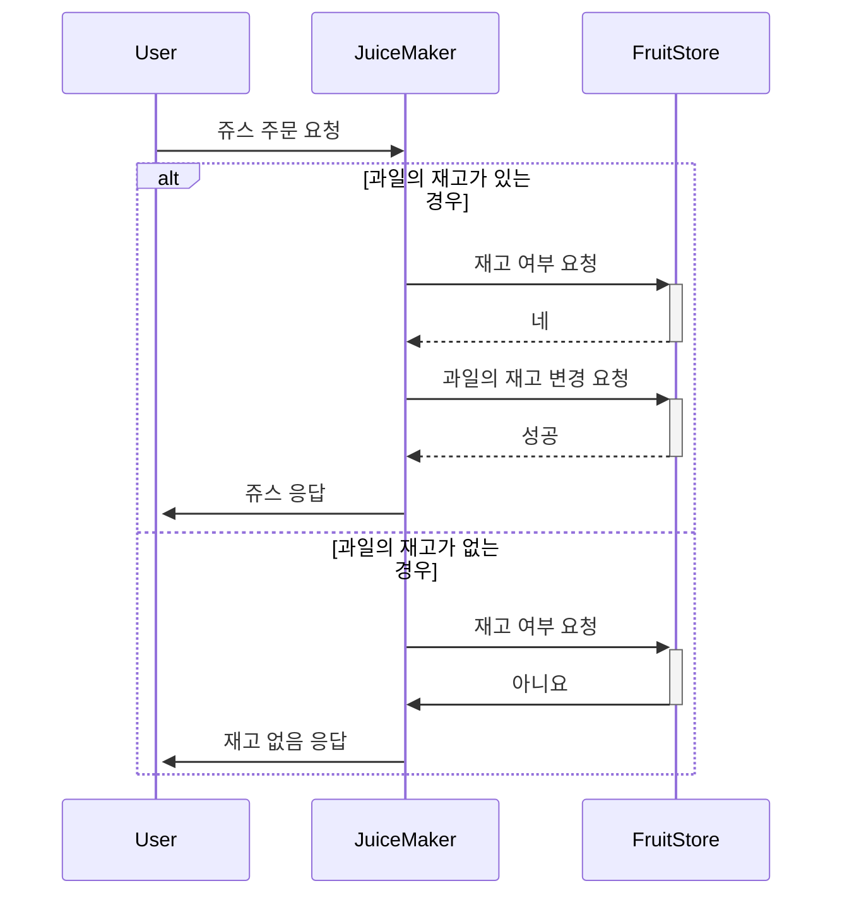

# ios-juice-maker
iOS 쥬스 메이커 재고관리 시작 저장소

## Sequence Diagram

```mermaid
sequenceDiagram
    User->>JuiceMaker: 쥬스 주문 요청
    alt 과일의 재고가 있는 경우
        JuiceMaker->>+FruitStore: 재고 여부 요청
        FruitStore-->>-JuiceMaker: 네
        JuiceMaker->>+FruitStore: 과일의 재고 변경 요청
        FruitStore-->>-JuiceMaker: 성공
        JuiceMaker->>+User: 쥬스 응답
    else 과일의 재고가 없는 경우
        JuiceMaker->>+FruitStore: 재고 여부 요청
        FruitStore->>-JuiceMaker: 아니요
        JuiceMaker->>+User: 재고 없음 응답
    end
```
